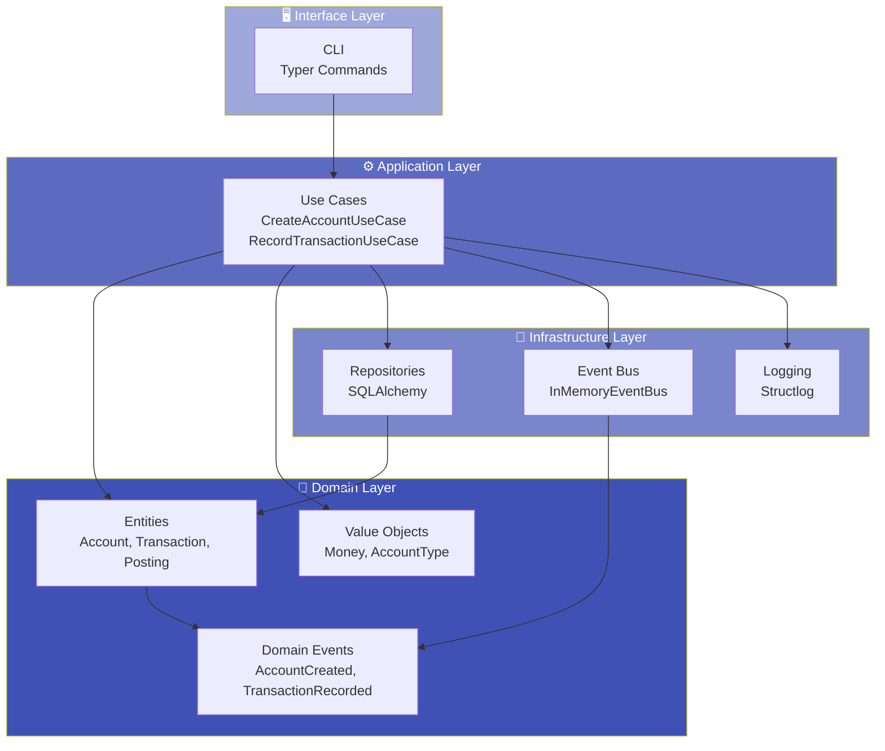
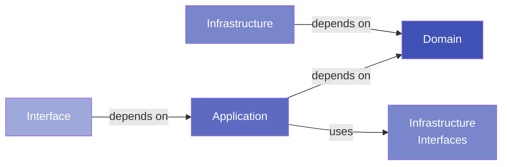
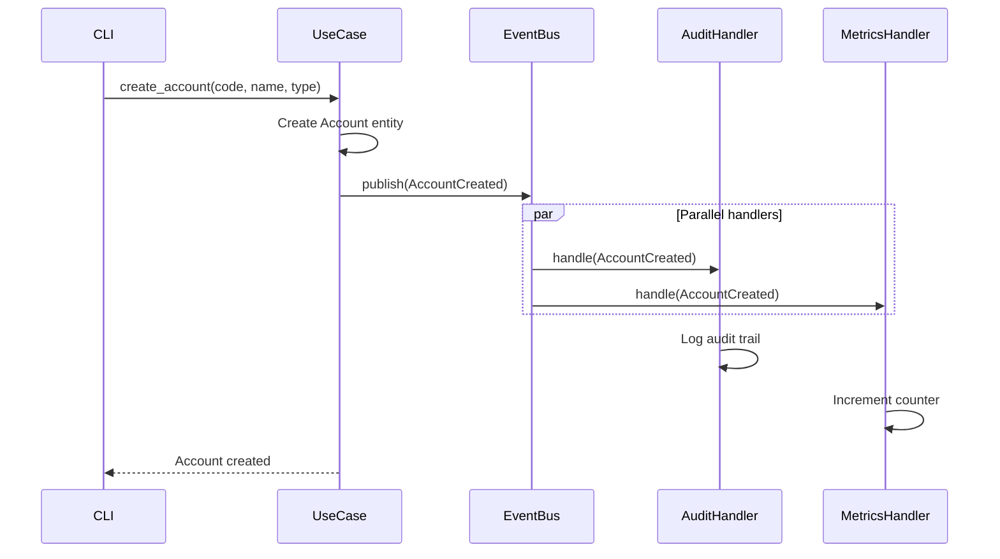

# Architecture Overview

Finlite is built with **Clean Architecture** principles, ensuring maintainability, testability, and extensibility.

---

## Design Philosophy

### Core Principles

:material-shield-check: **Separation of Concerns** - Clear boundaries between layers  
:material-arrow-decision: **Dependency Inversion** - Depend on abstractions, not concretions  
:material-lock: **Business Logic Isolation** - Domain logic independent of infrastructure  
:material-test-tube: **Testability** - Easy to test with mocks and stubs  
:material-cog: **Extensibility** - Add features without modifying existing code  

---

## Layer Architecture



---

## Layers Explained

### 🖥️ Interface Layer

**Responsibility**: User interaction and external communication

**Components**:

- **CLI** (`finlite/interfaces/cli/`) - Typer-based command-line interface

**Dependencies**: Application Layer only

**Example**:

```python
@app.command()
def create(
    code: str,
    name: str,
    type: AccountType,
    currency: str = "USD",
) -> None:
    """Create a new account."""
    container = create_container()
    use_case = container.create_account_use_case()
    
    account = use_case.execute(
        code=code,
        name=name,
        account_type=type,
        currency=currency,
    )
    
    console.print(f"✅ Account {account.code} created!")
```

---

### ⚙️ Application Layer

**Responsibility**: Orchestrate business logic and coordinate operations

**Components**:

- **Use Cases** (`finlite/application/use_cases/`) - Business operations
- **DTOs** (`finlite/application/dtos/`) - Data transfer objects

**Dependencies**: Domain Layer, Infrastructure interfaces (not implementations)

**Example**:

```python
class CreateAccountUseCase:
    def __init__(
        self,
        account_repo: IAccountRepository,
        event_bus: IEventBus,
    ):
        self._account_repo = account_repo
        self._event_bus = event_bus
        self._logger = get_logger(__name__)
    
    def execute(
        self,
        code: str,
        name: str,
        account_type: AccountType,
        currency: str = "USD",
    ) -> Account:
        self._logger.info("creating_account", account_code=code)
        
        # Check if account exists
        existing = self._account_repo.find_by_code(code)
        if existing:
            raise AccountAlreadyExistsError(code)
        
        # Create account entity
        account = Account.create(
            code=code,
            name=name,
            account_type=account_type,
            currency=currency,
        )
        
        # Persist
        self._account_repo.save(account)
        
        # Publish event
        event = AccountCreated(
            account_id=account.id,
            account_code=account.code,
            account_type=account.account_type,
            currency=account.currency,
        )
        self._event_bus.publish(event)
        
        self._logger.info("account_created", account_id=str(account.id))
        
        return account
```

---

### 💎 Domain Layer

**Responsibility**: Core business logic and rules

**Components**:

- **Entities** (`finlite/domain/entities/`) - Business objects with identity
- **Value Objects** (`finlite/domain/value_objects/`) - Immutable values
- **Domain Events** (`finlite/domain/events/`) - Things that happened
- **Domain Services** (`finlite/domain/services/`) - Business operations

**Dependencies**: NONE (pure business logic)

**Example**:

```python
@dataclass
class Account:
    """Account entity representing a financial account."""
    
    id: UUID
    code: str
    name: str
    account_type: AccountType
    currency: str
    is_active: bool = True
    parent_id: UUID | None = None
    created_at: datetime = field(default_factory=datetime.utcnow)
    updated_at: datetime = field(default_factory=datetime.utcnow)
    
    @staticmethod
    def create(
        code: str,
        name: str,
        account_type: AccountType,
        currency: str = "USD",
        parent_id: UUID | None = None,
    ) -> "Account":
        """Factory method to create a new account."""
        return Account(
            id=uuid4(),
            code=code,
            name=name,
            account_type=account_type,
            currency=currency,
            parent_id=parent_id,
        )
    
    def deactivate(self) -> None:
        """Deactivate the account."""
        self.is_active = False
        self.updated_at = datetime.utcnow()
```

---

### 🔧 Infrastructure Layer

**Responsibility**: External concerns and technical details

**Components**:

- **Repositories** (`finlite/infrastructure/persistence/`) - Data access
- **Event Bus** (`finlite/infrastructure/events/`) - Event publishing
- **Logging** (`finlite/shared/observability/`) - Structured logging

**Dependencies**: Domain interfaces, external libraries

**Example**:

```python
class SQLAlchemyAccountRepository(IAccountRepository):
    """SQLAlchemy implementation of account repository."""
    
    def __init__(self, session: Session):
        self._session = session
    
    def save(self, account: Account) -> None:
        """Save account to database."""
        account_model = AccountModel.from_entity(account)
        self._session.add(account_model)
        self._session.commit()
    
    def find_by_code(self, code: str) -> Account | None:
        """Find account by code."""
        account_model = (
            self._session.query(AccountModel)
            .filter(AccountModel.code == code)
            .first()
        )
        return account_model.to_entity() if account_model else None
    
    def find_by_id(self, account_id: UUID) -> Account | None:
        """Find account by ID."""
        account_model = (
            self._session.query(AccountModel)
            .filter(AccountModel.id == account_id)
            .first()
        )
        return account_model.to_entity() if account_model else None
```

---

## Dependency Flow

The **Dependency Rule**: Dependencies flow inward. Outer layers depend on inner layers, never the reverse.



**Key Points**:

- Domain layer has **zero dependencies**
- Application layer depends on **domain abstractions**
- Infrastructure implements **domain interfaces**
- Interface layer depends on **application layer**

---

## Event-Driven Architecture

Finlite uses **domain events** for loose coupling and observability.



### Benefits

✅ **Decoupled**: Handlers don't know about each other  
✅ **Extensible**: Add new handlers without modifying use cases  
✅ **Auditable**: Full event history for compliance  
✅ **Observable**: Metrics and logging via events  

---

## Dependency Injection

Finlite uses **dependency injection** for flexibility and testability.

### DI Container

```python
class Container:
    """Dependency injection container."""
    
    def __init__(self, db_path: str):
        self.db_path = db_path
        
        # Singletons
        self._session_factory = self._create_session_factory()
        self._event_bus = InMemoryEventBus()
        
        # Setup event handlers
        self._setup_event_handlers()
    
    def create_account_use_case(self) -> CreateAccountUseCase:
        """Create account use case with dependencies."""
        session = self._session_factory()
        account_repo = SQLAlchemyAccountRepository(session)
        
        return CreateAccountUseCase(
            account_repo=account_repo,
            event_bus=self._event_bus,
        )
```

### Testing Benefits

```python
def test_create_account_use_case():
    """Test account creation with mocks."""
    # Arrange
    mock_repo = Mock(spec=IAccountRepository)
    mock_event_bus = Mock(spec=IEventBus)
    
    use_case = CreateAccountUseCase(
        account_repo=mock_repo,
        event_bus=mock_event_bus,
    )
    
    # Act
    account = use_case.execute(
        code="TEST",
        name="Test Account",
        account_type=AccountType.ASSET,
    )
    
    # Assert
    mock_repo.save.assert_called_once()
    mock_event_bus.publish.assert_called_once()
    assert account.code == "TEST"
```

---

## Design Patterns

### Repository Pattern

Abstracts data access behind interfaces:

```python
class IAccountRepository(ABC):
    """Account repository interface."""
    
    @abstractmethod
    def save(self, account: Account) -> None: ...
    
    @abstractmethod
    def find_by_code(self, code: str) -> Account | None: ...
    
    @abstractmethod
    def find_by_id(self, account_id: UUID) -> Account | None: ...
```

### Factory Pattern

Creates complex objects:

```python
@staticmethod
def create(
    code: str,
    name: str,
    account_type: AccountType,
) -> "Account":
    """Factory method to create account."""
    return Account(
        id=uuid4(),
        code=code,
        name=name,
        account_type=account_type,
    )
```

### Observer Pattern

Event bus for publish/subscribe:

```python
event_bus.subscribe(AccountCreated, audit_handler)
event_bus.subscribe(AccountCreated, metrics_handler)
event_bus.publish(AccountCreated(...))
```

---

## Testing Strategy

### Pyramid of Tests

```
       /\
      /E2E\        ← 24 Integration tests (CLI)
     /------\
    /  INT   \     ← 50 Integration tests (Use Cases + DB)
   /----------\
  /   UNIT     \   ← 113 Unit tests (Domain + Logic)
 /--------------\
```

**Test Distribution**:

- **Unit Tests** (113): Domain entities, value objects, services
- **Integration Tests** (50): Use cases with real database
- **CLI Tests** (24): End-to-end command tests

**Total**: 187 tests ✅

---

## Project Structure

```
finlite/
├── domain/                      # 💎 Domain Layer
│   ├── entities/               # Business entities
│   ├── value_objects/          # Immutable values
│   ├── events/                 # Domain events
│   └── services/               # Domain services
│
├── application/                 # ⚙️ Application Layer
│   ├── use_cases/              # Business operations
│   └── dtos/                   # Data transfer objects
│
├── infrastructure/              # 🔧 Infrastructure Layer
│   ├── persistence/            # Database, repositories
│   └── events/                 # Event bus, handlers
│
├── interfaces/                  # 🖥️ Interface Layer
│   └── cli/                    # CLI commands
│
└── shared/                      # Shared utilities
    ├── di/                     # Dependency injection
    └── observability/          # Logging, monitoring
```

---

## Next Steps

Learn more about each layer:

- [Domain Layer](domain.md) - Entities, value objects, events
- [Application Layer](application.md) - Use cases and DTOs
- [Infrastructure Layer](infrastructure.md) - Persistence and events
- [Event Bus](event-bus.md) - Event-driven architecture
