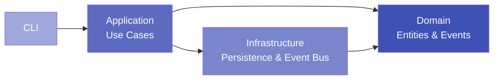

# Finlite

<div align="center">

**Local-first personal finance toolkit with double-entry accounting**

[](https://github.com/lgili/finapp)
[](https://www.python.org/)
[](https://github.com/astral-sh/ruff)
[](http://mypy-lang.org/)
[](https://opensource.org/licenses/MIT)

</div>

---

## What is Finlite?

Finlite is a **modern, local-first personal finance application** built with **Clean Architecture** principles and **double-entry bookkeeping**. It provides a powerful CLI for managing your finances with the precision of professional accounting software.

### Key Features

:material-check-circle:{ .green } **Double-Entry Accounting** - Rock-solid financial tracking with balanced transactions  
:material-check-circle:{ .green } **Clean Architecture** - Maintainable, testable, and extensible codebase  
:material-check-circle:{ .green } **Event-Driven** - Domain events for audit trails and observability  
:material-check-circle:{ .green } **Structured Logging** - Production-ready logging with JSON output  
:material-check-circle:{ .green } **Multi-Currency** - Support for multiple currencies (USD, BRL, EUR, etc.)  
:material-check-circle:{ .green } **Local-First** - Your data stays on your machine (SQLite database)  
:material-check-circle:{ .green } **Type-Safe** - Full type checking with mypy  
:material-check-circle:{ .green } **Well-Tested** - 187 tests (163 unit + 24 integration)  

---

## Quick Start

Get up and running in 3 minutes:

```bash title="Installation"
# Clone the repository
git clone https://github.com/lgili/finapp.git
cd finapp/backend

# Create virtual environment
python -m venv .venv
source .venv/bin/activate  # On Windows: .venv\Scripts\activate

# Install package
pip install -e .

# Initialize database
fin init-db
```

```bash title="Create Your First Account"
fin accounts create --code "CASH" --name "Cash" --type ASSET
```

```bash title="Record Your First Transaction"
fin transactions create --description "Initial balance"
# Posting 1: CASH, 1000
# Posting 2: EQUITY, -1000
```

[Get Started →](getting-started/installation.md){ .md-button .md-button--primary }
[View on GitHub](https://github.com/lgili/finapp){ .md-button }

---

## Architecture Highlights

Finlite follows **Clean Architecture** with clear separation of concerns:



### Layers

- **Domain**: Pure business logic (Entities, Value Objects, Events)
- **Application**: Use Cases orchestrating business operations
- **Infrastructure**: External concerns (Database, Event Bus, Logging)
- **Interface**: CLI for user interaction

[Learn More →](architecture/overview.md)

---

## Example Usage

### Managing Accounts

```bash
# Create accounts
fin accounts create -c "CHECKING" -n "Checking Account" -t ASSET
fin accounts create -c "GROCERIES" -n "Groceries" -t EXPENSE
fin accounts create -c "SALARY" -n "Salary" -t INCOME

# List all accounts
fin accounts list

# Get account balance
fin accounts balance CHECKING
```

### Recording Transactions

```bash
# Receive salary (increase asset, increase income)
fin transactions create -d "Monthly salary"
# Posting 1: CHECKING, 5000
# Posting 2: SALARY, -5000

# Pay for groceries (increase expense, decrease asset)
fin transactions create -d "Weekly groceries"
# Posting 1: GROCERIES, 150
# Posting 2: CHECKING, -150

# View transactions
fin transactions list --account CHECKING --limit 10
```

### Debug Mode

```bash
# Enable debug logging
fin --debug accounts create -c "TEST" -n "Test" -t ASSET

# JSON output for log aggregation
fin --json-logs transactions list
```

[Full CLI Reference →](user-guide/cli-reference.md)

---

## Design Principles

### :material-shield-check: Type Safety

100% type-checked with mypy. No `Any` types in production code.

```python
def create_account(
    account_repo: IAccountRepository,
    event_bus: IEventBus,
    code: str,
    name: str,
    account_type: AccountType,
) -> Account:
    ...
```

### :material-database: Data Integrity

Double-entry bookkeeping ensures every transaction balances:

```python
# This will fail validation
transaction = Transaction(
    postings=[
        Posting(account_id=cash_id, amount=Decimal("100")),  # Debit
        Posting(account_id=income_id, amount=Decimal("-50")),  # Credit
    ]
)
# ValueError: Transaction doesn't balance! Total: 50
```

### :material-cog: Dependency Injection

Clean separation with dependency injection container:

```python
container = create_container(db_path="finlite.db")
use_case = container.create_account_use_case()
```

### :material-bell: Event-Driven

Domain events for observability and audit trails:

```python
# Events are automatically published
account = use_case.execute(code="CASH", name="Cash", type=AccountType.ASSET)
# → AccountCreated event published
# → AuditLogHandler logs the event
# → MetricsEventHandler tracks the count
```

---

## Why Finlite?

### For Users

- ✅ **Privacy**: Your financial data never leaves your machine
- ✅ **Accuracy**: Double-entry accounting catches errors automatically
- ✅ **Flexibility**: Multi-currency support, unlimited accounts
- ✅ **Transparency**: Full audit trail with event logging

### For Developers

- ✅ **Clean Code**: SOLID principles, Clean Architecture
- ✅ **Well-Tested**: 187 tests with high coverage
- ✅ **Type-Safe**: Full mypy type checking
- ✅ **Extensible**: Event-driven design, dependency injection
- ✅ **Modern Stack**: Python 3.11+, Pydantic, SQLAlchemy, Typer

---

## Roadmap

- [x] **Phase 0-5**: Core accounting, Clean Architecture migration
- [x] **Phase 6**: Event Bus & Domain Events
- [x] **Phase 7**: Structured Logging & Documentation
- [ ] **Phase 8**: Bank statement import (Nubank, OFX)
- [ ] **Phase 9**: Rules engine for auto-classification
- [ ] **Phase 10**: Reports (Balance Sheet, Income Statement)
- [ ] **Phase 11**: Investment tracking (PM médio, P/L)
- [ ] **Phase 12**: TUI (Terminal UI) with Textual

[Full Roadmap →](roadmap.md)

---

## Contributing

We welcome contributions! Finlite is built with care and maintained with passion.

- 🐛 [Report bugs](https://github.com/lgili/finapp/issues/new?labels=bug)
- 💡 [Request features](https://github.com/lgili/finapp/issues/new?labels=enhancement)
- 📖 [Improve docs](https://github.com/lgili/finapp/edit/main/docs/)
- 🔧 [Submit PRs](https://github.com/lgili/finapp/pulls)

[Contributing Guide →](development/contributing.md)

---

## License

Finlite is open-source software licensed under the [MIT License](https://opensource.org/licenses/MIT).

---

<div align="center">

**Built with ❤️ for financial clarity**

[Documentation](getting-started/installation.md) • 
[GitHub](https://github.com/lgili/finapp) • 
[Issues](https://github.com/lgili/finapp/issues)

</div>
